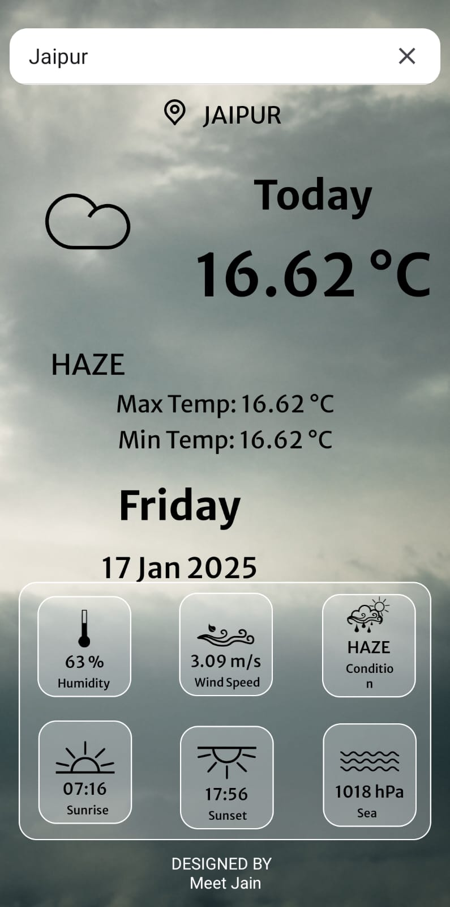
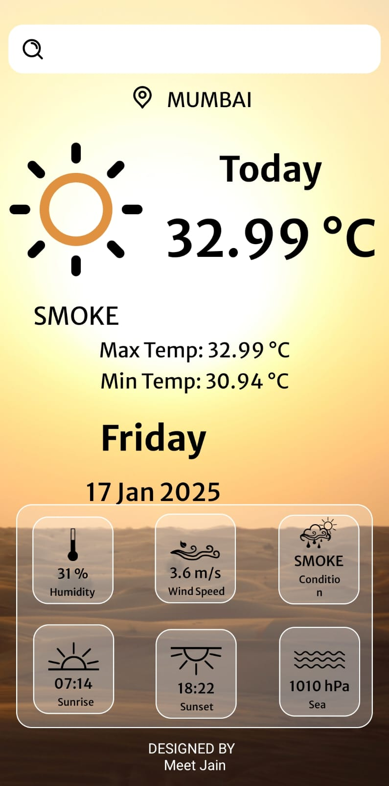
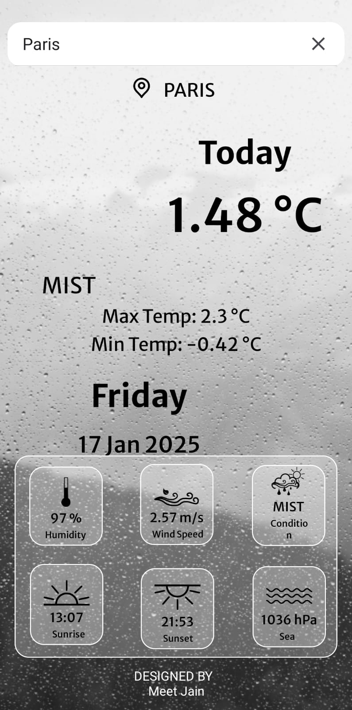
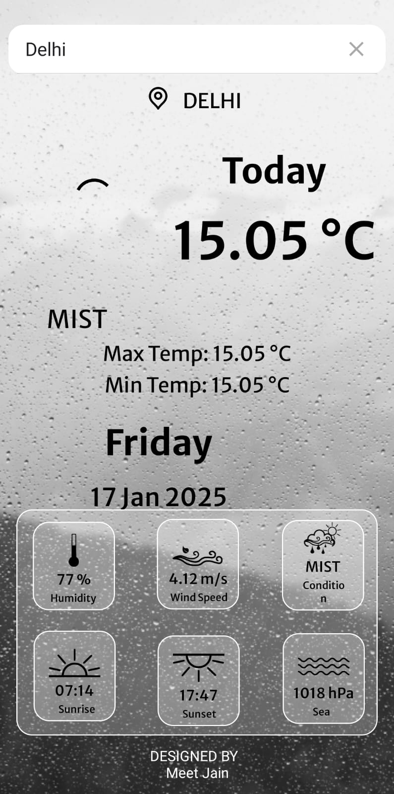
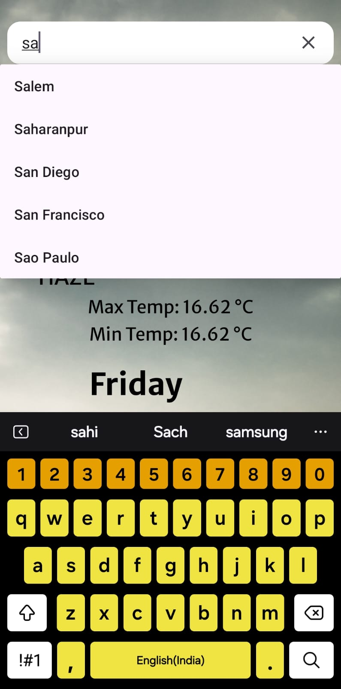
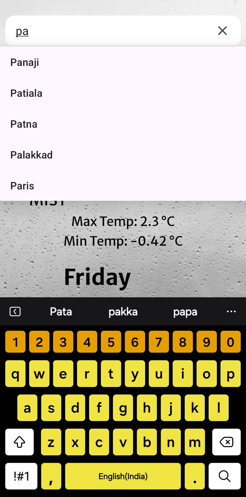

# **Weather App 🌦️**

## **Description**  
The Weather App provides real-time weather updates for cities worldwide. It’s built to deliver accurate weather details, including temperature, humidity, wind speed, and more, in an intuitive interface.

---

## **Features**  
- 🌍 **Search weather details** for any location globally  
- 🌡️ **Real-time temperature updates**  
- 💧 **Displays humidity and wind speed**  
- 🕒 **Fetches current date and time** for the selected city  
- 🎨 **Clean and responsive user interface**

---

## **Technologies Used**  
- **Android Development**: Kotlin  
- **Backend Services**: OpenWeatherMap API  
- **Tools**: Android Studio  

---

## **Installation and Setup**  
1. **Clone this repository**:  
   ```bash
   git clone https://github.com/meetjain6091/Weather-App.git
Open the project in Android Studio.

Add your OpenWeatherMap API key in the project.

Build and run the app on your emulator or physical device.


## **Screenshots**  

<div style="display: flex; flex-wrap: wrap; gap: 10px;">
  
  
  
  
  
  
  
</div>

## **Demo Video**  
[Download and Watch the Demo Video](https://drive.google.com/uc?id=1_mN7bbfcpJHg7bRQkRENdss2cEq-1Dd1&export=download)


## **Contact Me**  
For any questions or suggestions, reach out to Meet Mukesh Jain at meetjain6091@gmail.com
