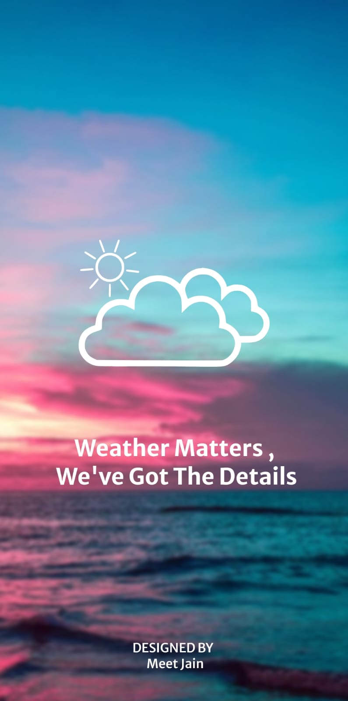

<div align="center">

# 🌤️ Weather App - Real-Time Global Forecast

_A sleek, minimalist Android application providing accurate weather insights with dynamic, condition-based UI._


</div>

---

## 📖 Overview

The **Weather App** is a native Kotlin-based Android application that delivers real-time weather updates for any city across the globe. Beyond just numbers, the app features an **adaptive UI** that changes its aesthetic—background colors and imagery—to match the current weather conditions of the searched location, providing a truly immersive experience.

## ✨ Features

- 🌍 **Global Search:** Fetch weather data for any city worldwide instantly.
- 🌡️ **Live Metrics:** Real-time updates for Temperature, Humidity, Wind Speed, and "Feels Like" conditions.
- 🎨 **Adaptive Design:** Beautifully themed backgrounds (Grey, Yellow, Blue, etc.) that shift based on the city's environment.
- 🔍 **Smart Suggestions:** Integrated search suggestions to help users find cities quickly and accurately.
- 🕒 **Time Sync:** Automatically displays the current date and time for the selected city.
- 📱 **Modern UI:** Built with clean XML layouts and smooth transitions for a premium feel.

---

## 📱 Visual Showcase

<table align="center" style="width:100%; border-collapse: collapse;">
  <tr>
    <td align="center" width="33%">
      
      <br><br>
      <b>Immersive Splash</b><br>
      <sup>Clean entry point with a modern weather-themed aesthetic.</sup>
    </td>
    <td align="center" width="33%">
      
      <br><br>
      <b>Dynamic Theming (Warm)</b><br>
      <sup>The UI adapts with vibrant colors for sunny or smoky conditions.</sup>
    </td>
    <td align="center" width="33%">
      
      <br><br>
      <b>Dynamic Theming (Mist)</b><br>
      <sup>A muted, clean palette for misty or foggy weather conditions.</sup>
    </td>
  </tr>
  <tr>
    <td align="center">
      
      <br><br>
      <b>Dynamic Theming (Cloudy)</b><br>
      <sup>Deep, atmospheric backgrounds for overcast and cloudy skies.</sup>
    </td>
    <td align="center">
      
      <br><br>
      <b>Smart Search</b><br>
      <sup>Integrated suggestions to make city searching fast and easy.</sup>
    </td>
    <td align="center">
      
      <br><br>
      <b>Global Reach</b><br>
      <sup>Accurate data fetching for international cities like Paris.</sup>
    </td>
  </tr>
</table>

---

## 🛠️ Tech Stack

- **Language:** [Kotlin](https://kotlinlang.org/)
- **Network:** [Retrofit](https://square.github.io/retrofit/) / [OpenWeather API](https://openweathermap.org/api)
- **UI:** XML / Material Design
- **IDE:** Android Studio

## 🚀 Installation & Setup

1. **Clone the Repo:**
   ```bash
   git clone [https://github.com/meetjain6091/Weather-App.git](https://github.com/meetjain6091/Weather-App.git)
   ```
2. API Key: Obtain a free API key from OpenWeatherMap and add it to your project's configuration.

3. Run: Open in Android Studio and deploy to an emulator or physical device.

Gemini said
This Weather App looks beautiful! I love how you’ve implemented dynamic backgrounds (grey, yellow, cloudy) that change based on the city or weather condition—it makes the UI feel very alive.

Since you've already pulled the remote changes and created a clean screenshots folder locally with descriptive names, we are going to use those for a much more professional look.

📁 The File Path
Ensure you are editing the file at the root:
WeatherApp/README.md

📝 The Professional README Code
Copy and paste this into your README.md. I have polished the descriptions and used a high-end gallery layout.

Markdown

<div align="center">

# 🌤️ Weather App - Real-Time Global Forecast

_A sleek, minimalist Android application providing accurate weather insights with dynamic, condition-based UI._


</div>

---

## 📖 Overview

The **Weather App** is a native Kotlin-based Android application that delivers real-time weather updates for any city across the globe. Beyond just numbers, the app features an **adaptive UI** that changes its aesthetic—background colors and imagery—to match the current weather conditions of the searched location, providing a truly immersive experience.

## ✨ Features

- 🌍 **Global Search:** Fetch weather data for any city worldwide instantly.
- 🌡️ **Live Metrics:** Real-time updates for Temperature, Humidity, Wind Speed, and "Feels Like" conditions.
- 🎨 **Adaptive Design:** Beautifully themed backgrounds (Grey, Yellow, Blue, etc.) that shift based on the city's environment.
- 🔍 **Smart Suggestions:** Integrated search suggestions to help users find cities quickly and accurately.
- 🕒 **Time Sync:** Automatically displays the current date and time for the selected city.
- 📱 **Modern UI:** Built with clean XML layouts and smooth transitions for a premium feel.

---

## 📱 Visual Showcase

<table align="center" style="width:100%; border-collapse: collapse;">
  <tr>
    <td align="center" width="33%">
      
      <br><br>
      <b>Immersive Splash</b><br>
      <sup>Clean entry point with a modern weather-themed aesthetic.</sup>
    </td>
    <td align="center" width="33%">
      
      <br><br>
      <b>Dynamic Theming (Warm)</b><br>
      <sup>The UI adapts with vibrant colors for sunny or smoky conditions.</sup>
    </td>
    <td align="center" width="33%">
      
      <br><br>
      <b>Dynamic Theming (Mist)</b><br>
      <sup>A muted, clean palette for misty or foggy weather conditions.</sup>
    </td>
  </tr>
  <tr>
    <td align="center">
      
      <br><br>
      <b>Dynamic Theming (Cloudy)</b><br>
      <sup>Deep, atmospheric backgrounds for overcast and cloudy skies.</sup>
    </td>
    <td align="center">
      
      <br><br>
      <b>Smart Search</b><br>
      <sup>Integrated suggestions to make city searching fast and easy.</sup>
    </td>
    <td align="center">
      
      <br><br>
      <b>Global Reach</b><br>
      <sup>Accurate data fetching for international cities like Paris.</sup>
    </td>
  </tr>
</table>

---

## 🛠️ Tech Stack

- **Language:** [Kotlin](https://kotlinlang.org/)
- **Network:** [Retrofit](https://square.github.io/retrofit/) / [OpenWeather API](https://openweathermap.org/api)
- **UI:** XML / Material Design
- **IDE:** Android Studio

## 🚀 Installation & Setup

1. **Clone the Repo:**
   ```bash
   git clone [https://github.com/meetjain6091/Weather-App.git](https://github.com/meetjain6091/Weather-App.git)
   API Key: Obtain a free API key from OpenWeatherMap and add it to your project's configuration.
   ```
   Run: Open in Android Studio and deploy to an emulator or physical device.

---

## 🎥 Video Demo

<div align="center">
  <video src="screenshots/Weather%20Demo.mp4" width="320" controls muted autoplay loop>
    Your browser does not support the video tag.
  </video>
  <br>
  <sup><i>A quick walkthrough of the dynamic UI and real-time data fetching.</i></sup>
</div>

---
